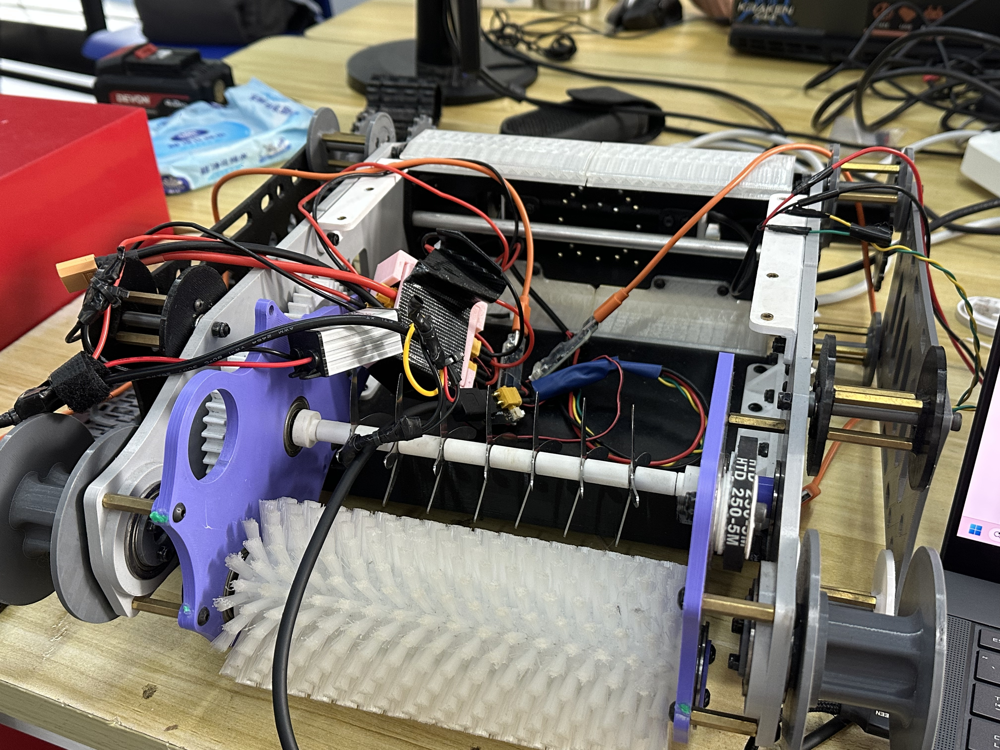
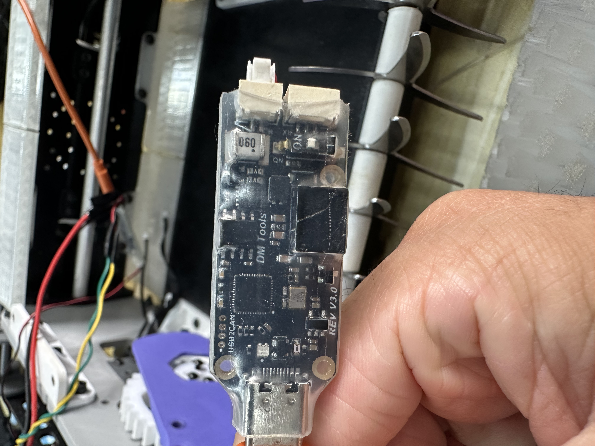
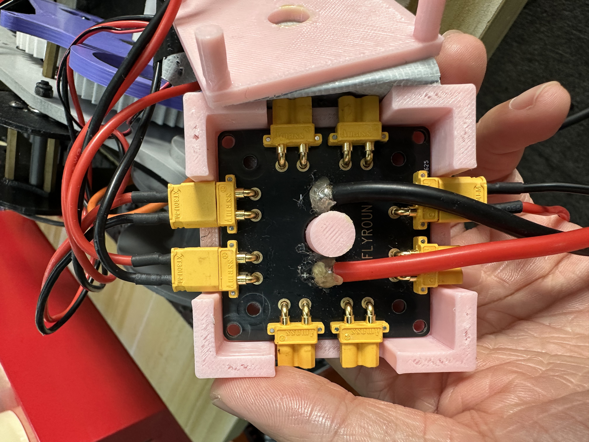
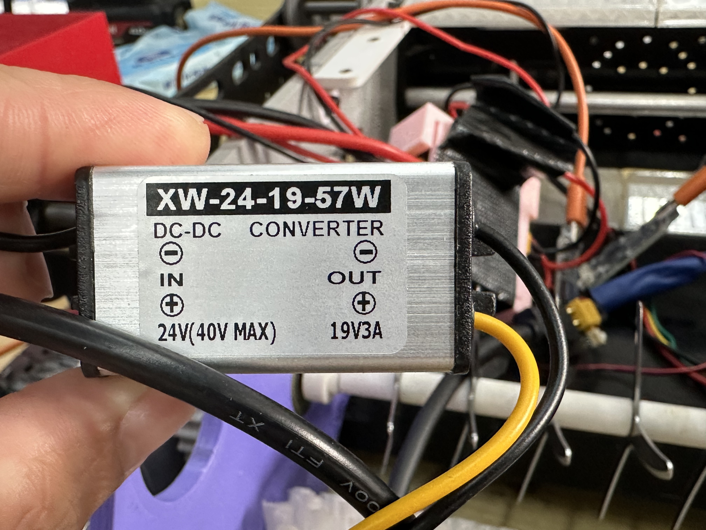
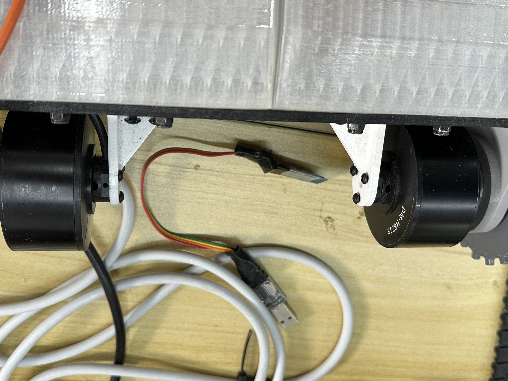
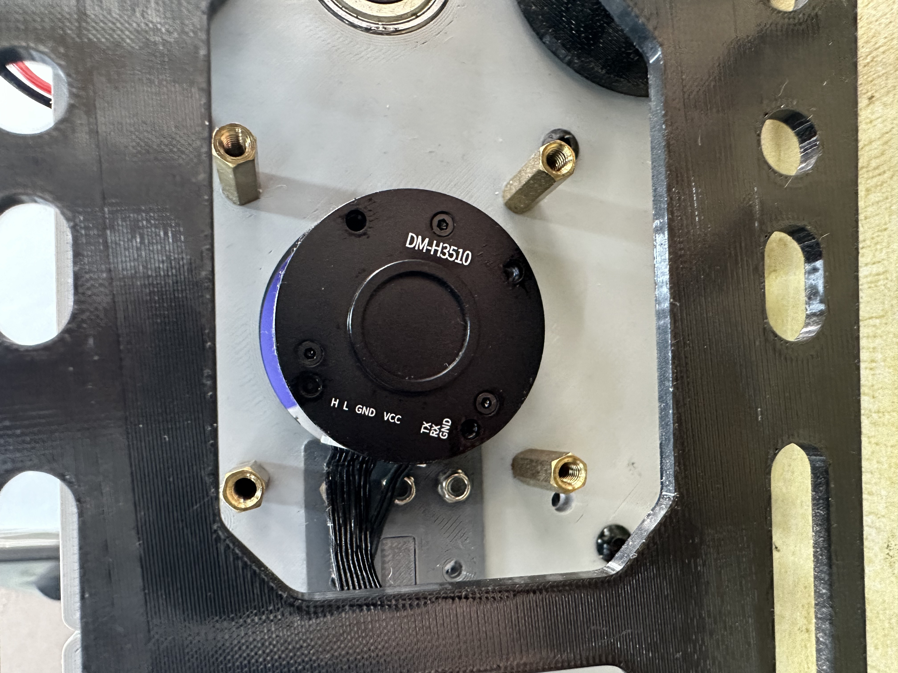
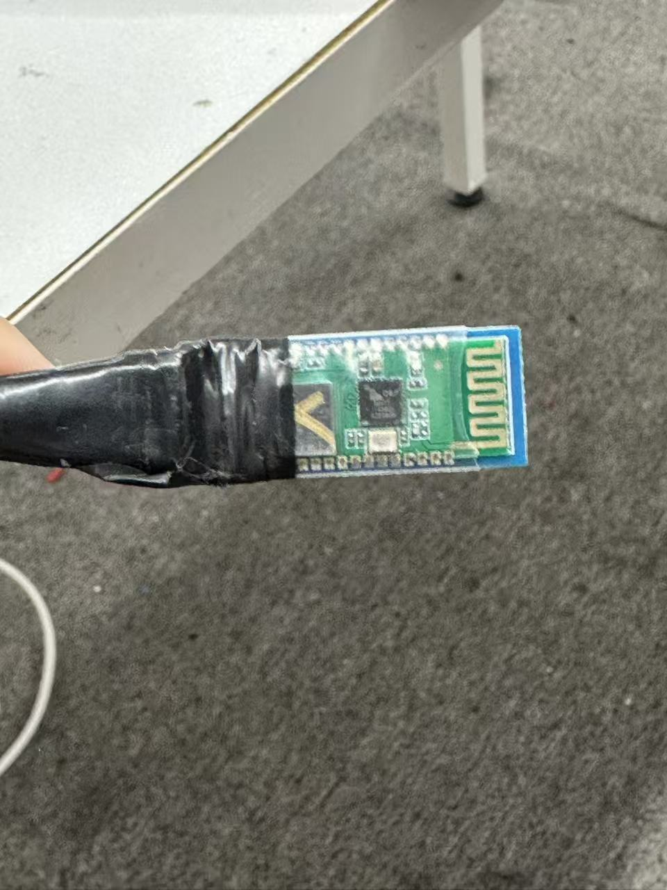
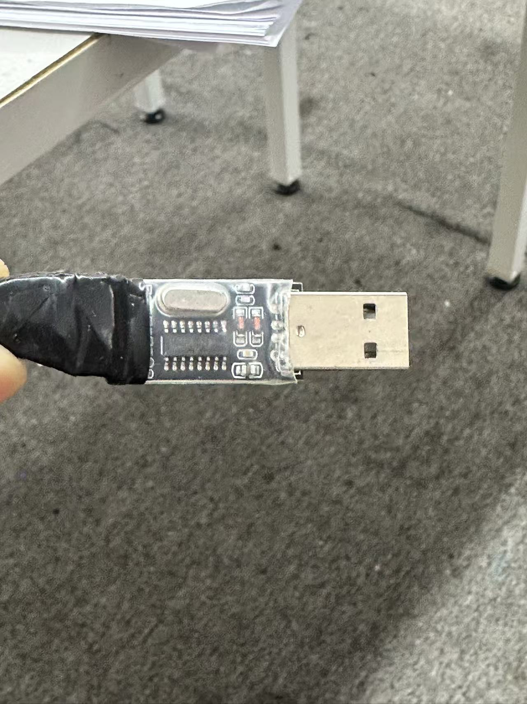
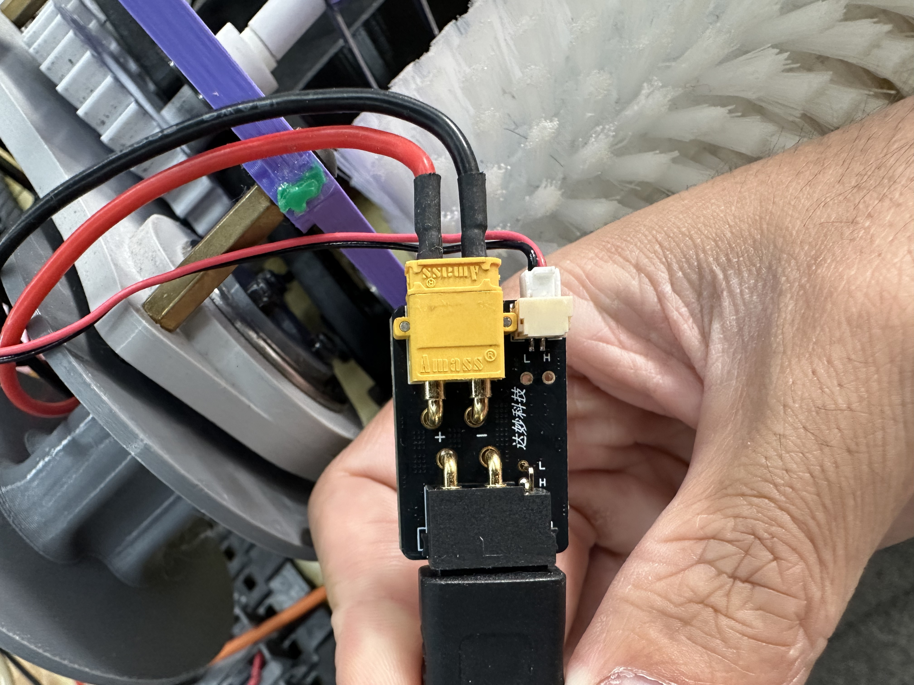

# 康莱德森林防火机器人

本仓库用于整理康莱德项目已有实车的接手资料，并记录后续改造与验证结果。当前首先要解决的问题是：**通过少量机构修改，让现有刀片机构能够打碎树叶。**

**今日任务：先恢复原机运行，排查并记录动不了的原因。具体顺序见 [TODO：执行清单](TODO.md)。恢复运行后再推进机构修改和树叶粉碎验证。**

图 1：现有实车，可见车架、前部滚刷、刀片轴及线束；照片不代表已通过运行或粉碎验收。

本文于 2026-09-23 根据项目提供者的描述、用途确认及实物照片重建。尚无原程序、机械图纸、接线图或历史测试记录可供核对，本文不是已完成系统的技术规格书。

## 当前进度

| 项目 | 已掌握的信息 | 依据与状态 |
| --- | --- | --- |
| 实物 | 已有实车和安装在车上的机构、电机及板卡 | 项目提供者说明及整车、局部照片 |
| 电机运行 | 据回忆，之前已实现电机转动 | 历史回忆；具体测试条件与当前运行状态待实车复核 |
| 树叶粉碎 | 之前刀片未达到打碎树叶的效果 | 项目提供者说明；失败原因尚未确认 |
| 软件与资料 | 重建文档前，仓库为空且没有历史提交 | 仓库检查；不代表其他设备上不存在原程序 |
| 今日任务 | 恢复原机运行，定位并记录不动作原因 | 现场结果待回填 |
| 阶段目标 | 尽量沿用现有硬件，少量修改机构，先验证少量树叶能够被打碎 | 恢复运行后优先推进 |

“电机能转”不能作为“粉碎功能完成”的依据。目前未记录粉碎成功的实测证据，也未验证当前整车功能。

## 现有硬件清单

下表区分照片可读信息与项目提供者确认的信息。照片上的标称值不等于实车测量值；未核实的接线和功能不作推定。

| 硬件 | 数量 | 用途或可见标识 | 依据及待确认内容 |
| --- | --- | --- | --- |
| 达妙 DM-H6215 电机 | 2 台 | 行走驱动 | 数量、型号及用途由项目提供者确认；照片 5 可见电机及 DM-H6215 标识；左右对应、传动比和通信参数待查 |
| 达妙 DM-H3510 电机 | 1 台 | 刀片驱动 | 型号、数量及用途由项目提供者确认；照片 6 可见 DM-H3510 标识；刀片连接和传动方式待查 |
| 主控板 | 待清点 | 疑似 ESP32-S3 | 仅来自项目提供者回忆，尚无主控铭牌或程序佐证，准确型号待确认 |
| 达妙电源＋CAN 通信转接板（按外观识别） | 照片中 1 块 | 将组合接口中的电源和 CAN 信号分接；可见“达妙科技”、正负极及 H／L 标识 | 照片 9；功能依据接口布局及同类产品资料判断，准确型号和实际接线待核实 |
| USB2CAN 板卡 | 照片中 1 块 | USB2CAN／DM Tools／REV V3.0 | 照片 2；具体配置及其在实车控制链路中的作用待确认，不能据此认定它是主控 |
| 分电板 | 照片中 1 块 | 可见 FLYROUN 字样及多个黄色电源接口 | 照片 3；品牌、准确型号、输入输出分配待核实，不统一归为达妙产品 |
| DC-DC 模块 | 照片中 1 个 | XW-24-19-57W；标签输入 24V（40V MAX），输出 19V 3A | 照片 4；仅抄录标签，实际输入电压、输出电压及供电对象待查 |
| 电池或供电电源 | 待清点 | 暂无明确规格 | 电池类型、额定电压、容量及保护配置待确认 |
| 带板载天线的模块 | 1 块，与下列 USB 接口板相连 | 可见绿色电路板及蛇形天线走线 | 照片 7；连接关系由项目提供者确认，芯片型号、无线协议及用途待核实 |
| USB-A 接口板 | 1 块，与上述模块相连 | 可见 USB-A 插头、芯片及晶振 | 照片 8；具体芯片及接口功能待确认，不能据外观认定为主控或 USB2CAN |

尚未确认电机供电范围、实际工作电压、控制协议、CAN ID、波特率及主控引脚。不能根据 DC-DC 标签反推整车或电机供电电压，也不能根据板卡接口外观直接形成接线方案。

## 实物照片

九张照片已保存在 [docs/images/](docs/images/)，保留上传时的文件名。照片 1 为本文开头的整车照，照片 2–9 如下。

### 照片 2：USB2CAN 板卡

图 2：实车上的 USB2CAN 板卡，可见 DM Tools、REV V3.0 标识；其在控制链路中的具体作用待确认。

### 照片 3：分电板

图 3：带 FLYROUN 字样的分电板及安装支架，具体型号和各支路用途待确认。

### 照片 4：DC-DC 模块

图 4：XW-24-19-57W 模块，标签标称输入 24V（最高 40V）、输出 19V 3A；实际供电条件及负载待核实。

### 照片 5：行走电机

图 5：两台大电机及安装结构，其中可见 DM-H6215 标识；项目提供者已确认两台均为 DM-H6215，用于行走。

### 照片 6：刀片驱动电机

图 6：DM-H3510 电机及安装板；项目提供者已确认其用于刀片驱动。

### 照片 7–8：相连的天线模块与 USB 接口板

图 7：带板载天线的模块，芯片文字不足以确认准确型号或无线协议。

图 8：USB-A 接口板。项目提供者确认它与图 7 的模块相连，暂按一组待核实的通信组件记录。它是否用于原机无线控制、连接哪台设备、对端在哪里，均待确认；不预设蓝牙型号、串口参数或接线定义。

### 照片 9：达妙电源＋CAN 通信转接板

图 9：根据板上的“达妙科技”、`+／−`、`H／L` 标记及接口布局，判断为电机电源与 CAN 通信分接用的转接板。其布局与 [XT30 2+2 电源／CAN 分离板的产品说明](https://www.seeedstudio.com/XT30-2-2-Power-Separation-Board-p-6707.html)一致；这是功能识别，尚未确认实物的准确型号和版本。

| 照片中的位置 | 对应功能 | 核对要点 |
| --- | --- | --- |
| 左侧黑色组合接口 | 电源与 CAN 信号合并连接 | 板上可见电源正负极及 H／L 标记，线缆另一端去向待追踪 |
| 右上黄色接口、粗红黑线 | 电源正负极 | 以板上 `+／−` 标记及实际接线为准，工作电压待测 |
| 右下白色接口、细线 | CAN 通信 | `H` 为 CAN High，`L` 为 CAN Low；即使线色为红黑，也不能当作电源正负极 |

这块板用于接线转接，不应当作主控或 USB 转 CAN 设备。排查电机不动时，分别核对供电是否送达、CAN 接线是否正确及有无通信反馈；仅有电源并不能证明电机已收到运行指令。断电后再检查插接与通断，不能仅凭线色改线。

整车照片和转接板特写已归档；主控板、刀片细节及完整传动路径照片仍待补充。

## 下一阶段：先验证树叶粉碎效果

### 目标与边界

尽量保留现有电机、电控及主体结构，通过少量机构修改，先证明能够打碎少量树叶。本阶段暂不规定碎片粒径、单位时间处理量或连续工作时长，也不以自动导航、整车重构或比赛展示资料作为优先任务。

### 工作顺序

1. **复核实车现状。** 查明主控、供电、启停方式和电机对应关系，确认现有刀片、固定件、传动及进料路径，记录结构尺寸和改动前照片。
2. **记录原机构失败现象。** 在具备防护和可靠停机条件后进行受控检查，区分未接触叶片、叶片被推走、缠绕、卡料或负载下停转等实际现象。这些只是观察分类，不能提前当作已确认原因。
3. **确定最小改动。** 根据实物检查和失败现象确定本轮机构修改，记录改动位置、原因及预期效果。在缺少尺寸和实测信息时，不预设刀片方案、转速或电机更换结论。
4. **少量投料验证。** 记录叶片干湿状态、投料量、运行现象、卡料和停机情况，保留处理前后照片及过程视频。
5. **根据证据决定下一轮。** 首轮成功后再讨论重复性、连续送料、粒径和处理效率；未成功则保留结果，按观察到的问题继续小幅调整。

试验前确认刀片固定、防护及停机方式。清理卡料或调整机构前须断电，并等待刀片完全停止。

### 首次验收标准

- 少量树叶经过机构处理后出现明显破碎，有处理前后对照照片和过程视频支持。
- 记录叶片干湿状态、投料量、机构改动，以及卡料、人工干预和停机情况。
- 电机空转或叶片仅被推走不算粉碎成功；一次成功只证明初步可行，不代表已达到稳定连续处理能力。

当前验收状态：**尚未验证通过。**

### 单次试验记录模板

| 记录项 | 填写内容 |
| --- | --- |
| 日期与记录人 | 待填写 |
| 本轮机构改动 | 改动位置、原因、改动前后照片 |
| 叶片条件与投料量 | 叶片种类（如已知）、干湿状态、数量或质量 |
| 运行条件 | 实际使用的供电、控制设置及运行时长；未知项明确写“未测” |
| 观察结果 | 是否明显破碎，有无推叶、缠绕、卡料或停转 |
| 人工干预与停机 | 是否发生、原因及处理过程 |
| 证据 | 处理前后照片和过程视频的文件路径 |
| 本轮结论与下一步 | 是否达到首次验收标准，下一项需要验证的问题 |

## 待补资料

- [ ] 主控板正反面照片、准确型号及开发环境。
- [ ] 原程序、依赖、烧录方法、历史控制方式及可用备份位置。
- [ ] 电池或电源规格、各供电支路用途及实际电压。
- [ ] 完整接线图、板卡型号、通信链路、电机 ID、波特率及控制模式。
- [ ] 刀片结构、尺寸、材料、固定方式及电机到刀片的传动关系。
- [ ] 进料路径、间隙、出料方式及原机构失败现象。
- [x] 九张实物图片（含整车照片、相连模块和电源／CAN 转接板）已归档并在本文展示。
- [ ] 相连的天线模块与 USB 接口板型号、用途、原连接设备及通信对端。
- [ ] 主控、刀片细节和完整传动路径照片，以及电源／CAN 转接板实际线缆去向。
- [ ] 首次粉碎试验记录、处理前后照片及过程视频。

后续更新时，为新确认的信息注明依据，例如铭牌照片、接线追踪、程序检查或实测记录；尚未核实的内容继续保留待确认标记。
