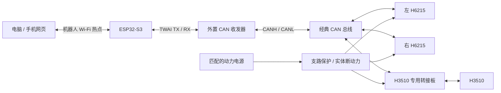

# 硬件接口与现场参数表

更新时间：2026-09-24。用于把“已知事实”和“待填写配置”连接起来，不是未核对即可照接的针脚图。

## 当前事实

| 项目 | 已确认 | 待补 |
| --- | --- | --- |
| H6215 | 用户报告昨天通过达妙官方软件调通，速度约 28 rps | 一台还是两台、模式、单位来源、ID、供电、是否空载 |
| H3510 | 因缺 SH1.0 3pin＋8pin 转 XT30＋GH1.25 转接板未测试 | 到货、接线、电源、通信、空载与机构测试 |
| 主控 | COM4 实测 ESP32-S3 revision v0.2、8 MB Flash；芯片报告内置 8 MB PSRAM；USB 烧录与启动成功 | 开发板完整型号、PSRAM 读写、非 USB 供电与可用 GPIO |
| CAN 收发器 | 用户确认目前只有主控，未备齐收发器 | 兼容 3.3V 逻辑的具体模块、供电、使能、终端及线束 |
| 停机 | 当前只有电源开关或拔插头 | 可及时操作且额定合适的实体动力切断方案 |
| 旧天线组件 | 用户判断疑似蓝牙模块 | 芯片型号、串口/无线协议与原连接关系仍未核实；当前 Wi-Fi 控制不依赖它 |

**速度单位需复核：** 6215 官方教程使用 rad/s。用户报告的“28 rps”按原文保留，不改成实测 rad/s；若原界面实际为 28 rad/s，则相当于约 4.46 rps。两者不能混用。

## 控制链路

每台转接板只有一个 CAN 口时如何分接、终端放哪里、是否需要 USB2CAN，见 [三电机共总线布线](can-bus-layout.md)。

USB2CAN 继续用于官方软件逐台调试。进行 ESP32 控制测试时，不让官方软件同时发动作命令。
外置收发器提供 CAN 物理层；电源/CAN 分接板只改变接线接口，两者不能替代。

## 接口核对表

| 接口 | 用途 | 要填的证据 / 参数 | 当前软件行为 |
| --- | --- | --- | --- |
| ESP32 主控 USB | 开发、烧录、控制台 | 完整板型号、设备端口、供电要求 | 不自动选串口、不自动烧录 |
| ESP32 → 收发器 TXD | TWAI 发送 | 实际 GPIO、逻辑电平、复用占用 | GPIO 默认为 −1 |
| 收发器 RXD → ESP32 | TWAI 接收 | 实际 GPIO、逻辑电平、复用占用 | GPIO 默认为 −1 |
| 收发器 VCC / GND / EN | 物理层供电与使能 | 模块说明、供电值、使能电平、地参考或隔离 | 不预设型号与使能引脚 |
| CANH / CANL | 共用经典 CAN 总线 | H/L 走向、总线两端终端、所有设备速率一致 | 波特率默认为 0，禁止初始化 |
| H6215 接口 | 动力＋CAN 分接 | 两台分别对应左右轮，连接器正负极与 H/L | 电机默认未核对 |
| H3510 8 pin | 动力＋CAN | 专用转接板准确型号、逐项对照原厂线序 | 不凭照片猜针脚 |
| H3510 3 pin | 调试串口 | 仅按匹配工具说明使用 | 不连接到 CANH/CANL |
| 动力输入与分支 | 电机供电 | 电池标签、实测电压、保护与线束额定 | 无法通过软件确认接线正确 |
| 主控低压供电 | 逻辑电源 | 合适的稳压模块或开发阶段 USB | 现有 19V 输出不能直接当作主控电源 |
| 实体动力切断 | 停机 | 切断范围、负载额定、可达性和实测动作 | 网页只提供软件停止 |

Kconfig 的 `ROBOT_BOARD_VERIFIED` 只有完成上述核对后才打开。软件支持 125k/250k/500k/1M 的经典 CAN，但最终值必须符合所有实物电机；尤其 H3510 手册写明 1M，不能仅因软件提供其他选项就认为实物支持。
实际 GPIO 没有依据前，不使用仓库早期文档中的候选 GPIO4/5 作为最终接线。

## 每台电机的现场记录

三台分别复制填写；未知写“未测”，不要用模拟默认参数填表。

| 字段 | 记录 |
| --- | --- |
| 逻辑名称 / 型号 / 实物标识 | 待填写 |
| 测试日期 / 人员 / 空载或机构状态 | 待填写 |
| 达妙软件版本 / USB2CAN 标识 | 待填写 |
| 电机固件版本 | 待填写 |
| 供电标签 / 测量点 / 实测电压 | 待填写 |
| CAN 波特率 / 经典 CAN 或 CAN FD | 待填写 |
| CAN ID / Master ID（注明十进制或十六进制） | 待填写 |
| 实际控制模式（首版固件要求速度模式） | 待填写 |
| V_MAX 映射范围 / 读回截图 | 待填写 |
| 设定转速 / 反馈转速 / 原界面单位 | 待填写 |
| 安装正方向 / 低速方向验证 | 待填写 |
| 本轮允许上限 / 加减速设置与依据 | 待填写 |
| 电机 TIMEOUT 原始值 / 单位来源 / 断通信实测 | 待填写 |
| 使能、停止、重启后状态 | 待填写 |
| 原始 CAN 报文 / 日志 / 照片或视频路径 | 待填写 |

`feedback_timeout_ms` 是 ESP32 侧反馈判据，与电机内部 `TIMEOUT` 不是同一个参数；不能直接把毫秒数写入未知单位的电机寄存器。
先用官方工具读回并备份，再按匹配版本手册设置；本程序不会自动写入任何电机寄存器。
H3510 供电需按对应实物版本手册核对，仓库已有手册记录为 24–30V；不能根据“22V 锂电池”描述认定匹配。
